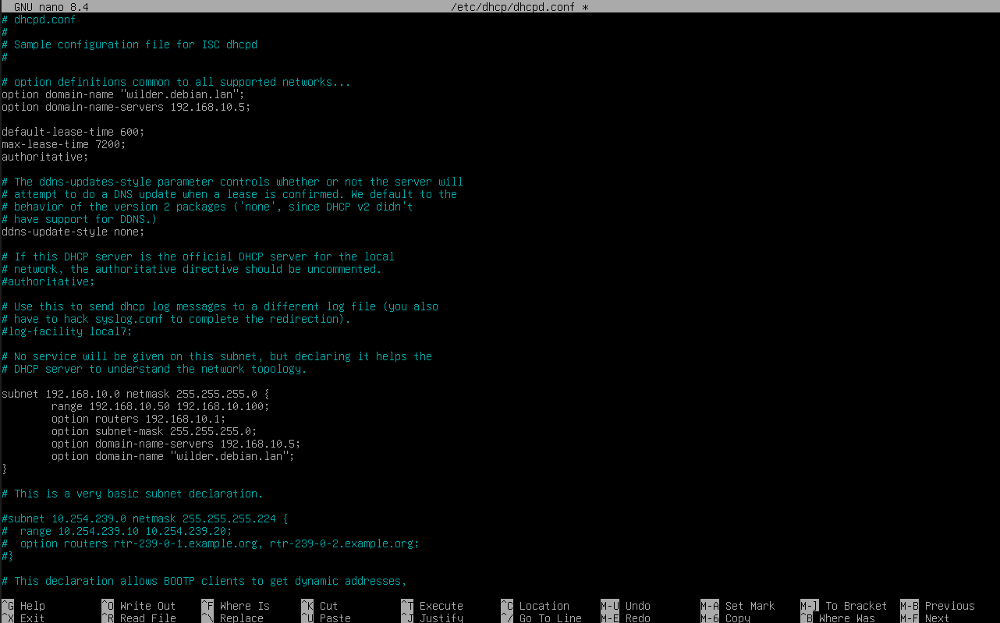
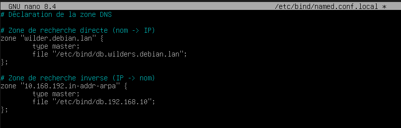
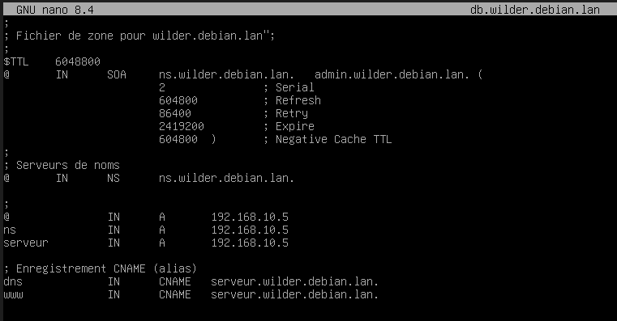
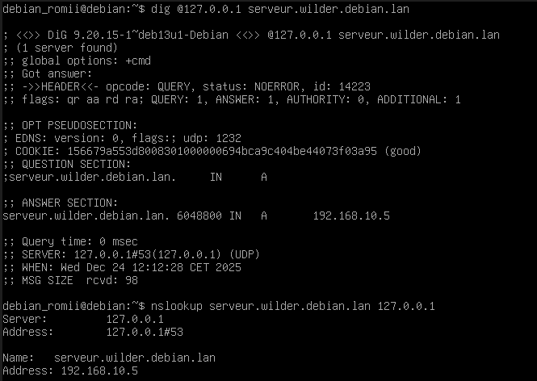
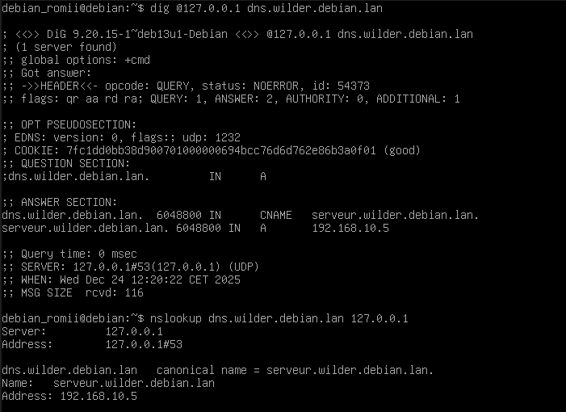
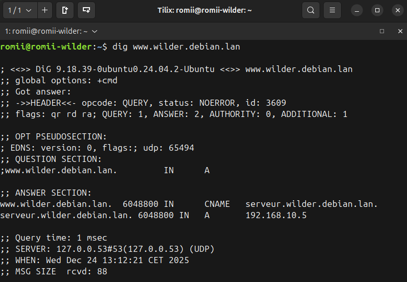
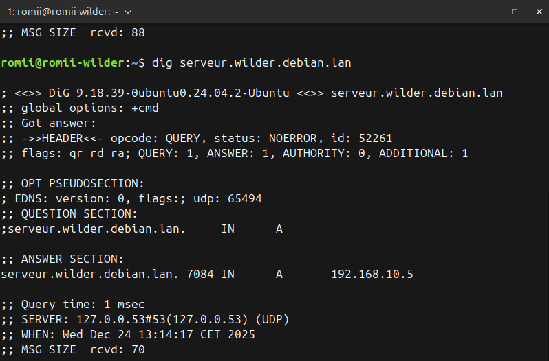
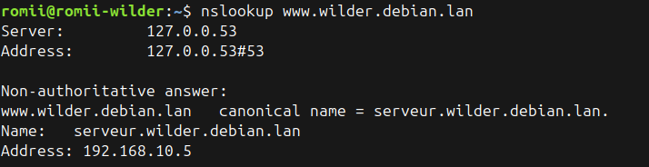

# Serveur_DNS_avec_Debian

## Configurations du serveur DNS :

* Le rajouter dans la configuration du serveur DHCP

* Déclaration des zones DNS

* Zone directe avvec les alias

## Test du serveur DNS sur la Debian :

* Directe

* Allias

## Test du serveur DNS sur la machine client :

* Test sur la machine client avec diverses commandes
